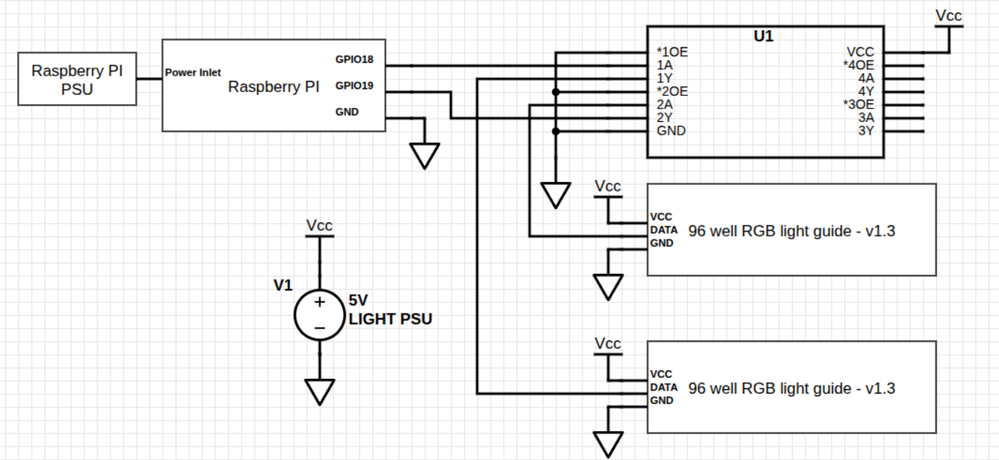

# microplate_light_example

An example repository that shows how you can drive the microplate light on a Raspberry Pi. This tutorial walks you through the hardware setup, configuring the Pi, setting up Python, installing dependencies, and running the example script.

## Hardware setup
The most important thing to remember about these boards is not to connect it directly to the Rasberries 5V line! These boards can draw up to 600mA current! The Raspberry Pi won't be able to supply that much power, causing it to choke. 
The solution is to use a separate power supply to power the boards and the Raspberry.
### Basic wiring
A bare bones wiring diagram can be seen below:

With this setup You are sparing the Raspberry's power supply from browning out.
#### Downside
The only downside with this wiring is that the Raspberry Pi outputs 3.3V logic, while the Neopixels use 5V logic. This means that commands can get lost or corrupted if the cables are too long. 
It worked well on my bench testing. 
You could try lowering the supply voltage to 4V, to bridge the gap a little, it still worked on my bench testing. 
### Advanced wiring

To counter the levels difference you can add a level shifter that will raise the voltage of the Raspberry's output to a 5V compatible range. One possible solution is using the [74AHCT125](https://thepihut.com/products/74ahct125-quad-level-shifter-3v-to-5v?srsltid=AfmBOorZnwDm3sFqUhs7Rj6OV8dRQ-N1yowjeKwoJUCeHB_LDmnzI0Pw) Chip. Here is an Example:



In this Example the 74AHCT125 acts as a voltage buffer to raise the signals going to the board. With this setup the communication will be more robust than before, with the expense of having to have a way to wire up the level shifter.

---
## Software setup
These steps take you through how to get the boards up and running with an included example python script

### Step 1: Configure PWM for NeoPixels

NeoPixels require precise timing via the Pi’s PWM hardware. Disable the onboard audio to free up the PWM channel.

Run:

```
sudo nano /boot/firmware/config.txt
```

Add this line at the end of the file:

```
dtoverlay=disable-audio
```

Save with Ctrl+O and exit with Ctrl+X, then reboot:

```
sudo reboot
```

---

### Step 2: Install Python Development Tools

Install the necessary Python development headers and virtual environment support:
```
sudo apt install python3-dev -y  
sudo apt install python3-venv -y
```
---

### Step 3: Create a Python Virtual Environment

Inside your project folder, create a virtual environment:
```
python3 -m venv .venv
```
Activate it:
```
source .venv/bin/activate
```
---

### Step 4: Install Dependencies

With the virtual environment active, install required Python packages:
```
pip install -r requirements.txt
```
These packages include:

- rpi_ws281x – the low-level NeoPixel driver  
- adafruit-circuitpython-neopixel – a user-friendly Python library for NeoPixels

---

### Step 5: Run the Example Script

NeoPixels require root access to control the GPIO hardware, so run the script with sudo:
```
sudo ./.venv/bin/python src/microplate_light_test.py
```
You should see your microplate light LEDs cycle through red, green, and blue.

---

You are now ready to experiment with your microplate light and build custom animations!

